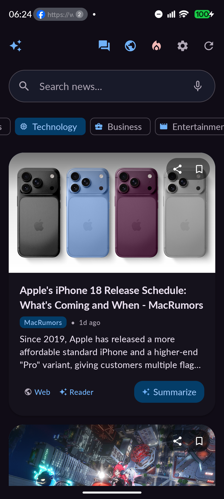
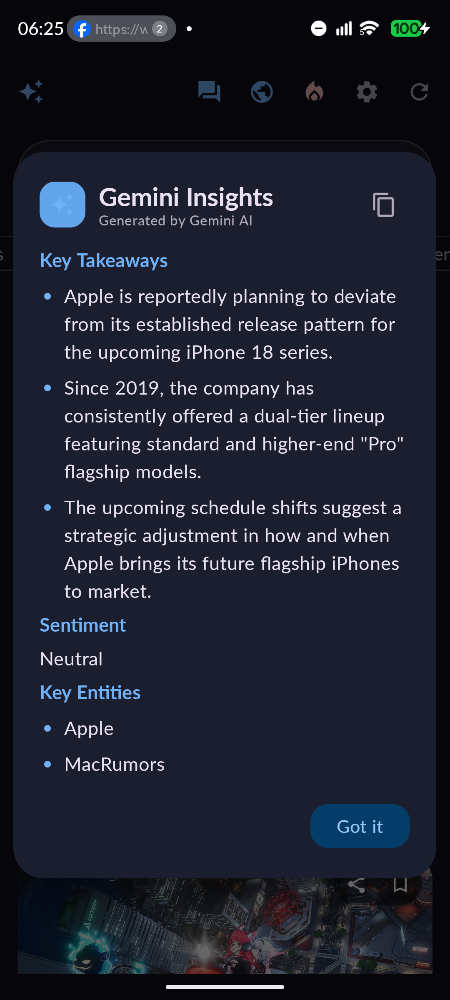
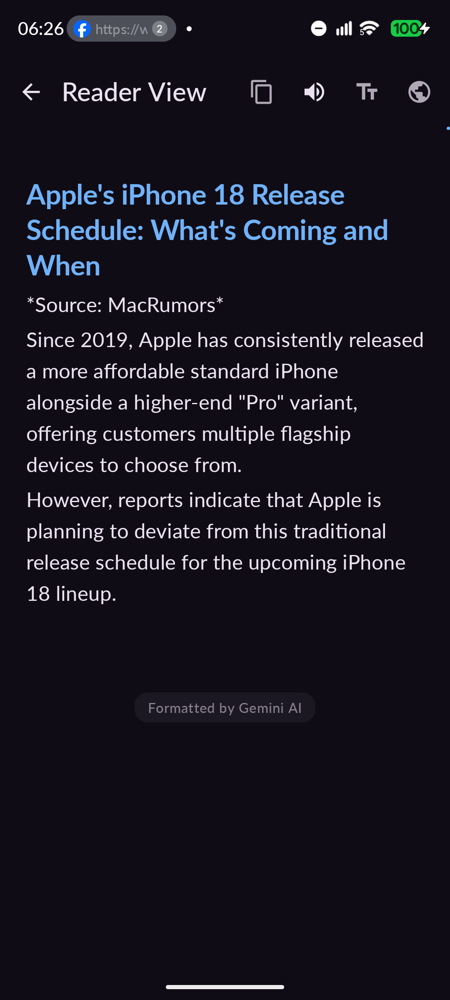
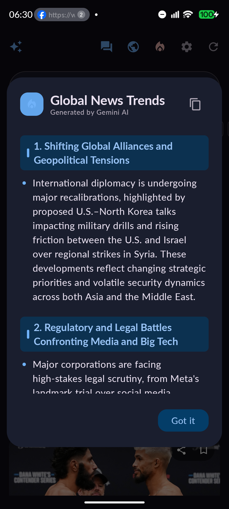
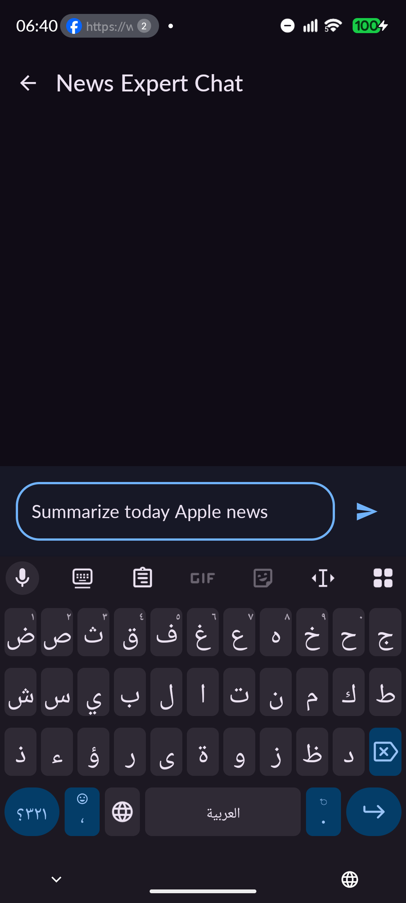
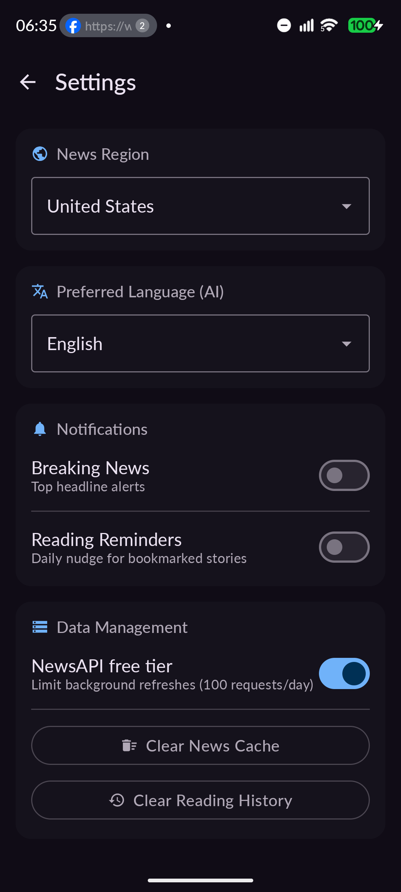

# ⚡ Gemini News — AI-Powered Android News Platform

<p align="center">
  
</p>

<p align="center">
  <strong>An intelligent, adaptive news ecosystem powered by Google Gemini AI and modern Android architecture.</strong>
</p>

<p align="center">
  
  
  
  
  
  
</p>

---

## 🌟 Overview

**Gemini News** is a next-generation Android news reader that combines real-time global news aggregation with **Google Gemini AI**. Instead of presenting endless walls of unfiltered articles, Gemini News synthesizes, contextualizes, and delivers distraction-free reporting tailored to your reading preferences.

Built with **100% Jetpack Compose**, **Material 3 Adaptive Design**, **Firebase Vertex AI**, and a resilient **Offline-First Room Architecture**, the app delivers desktop-grade fluidity on phones, foldables, and tablets.

---

## 📱 Screenshots Showcase

<div align="center">
  <table>
    <tr>
      <td align="center" width="33%">
        <br />
        <b>📰 Top Stories & Categories</b><br />
        <i>Modern card feeds with quick reader & summary actions</i>
      </td>
      <td align="center" width="33%">
        <br />
        <b>✨ Gemini Insights</b><br />
        <i>Structured takeaways, sentiment pills & key entities</i>
      </td>
      <td align="center" width="33%">
        <br />
        <b>📖 AI Reader View</b><br />
        <i>Distraction-free Markdown reader with Text-to-Speech</i>
      </td>
    </tr>
    <tr>
      <td align="center" width="33%">
        <br />
        <b>🔥 Global News Trends</b><br />
        <i>Macro-narrative synthesis across global events</i>
      </td>
      <td align="center" width="33%">
        <br />
        <b>💬 News Expert Chat</b><br />
        <i>Conversational AI briefed on today's headlines</i>
      </td>
      <td align="center" width="33%">
        <br />
        <b>⚙️ Settings & Privacy</b><br />
        <i>Region tuning, AI language, and quota management</i>
      </td>
    </tr>
  </table>
</div>

---

## 🚀 Core Capabilities

### 🧠 Gemini AI Intelligence
- **Gemini Insights (Smart Summaries)**: One-tap analysis generating structured **Key Takeaways**, **Sentiment & Tone** badges, and **Key Entities**.
- **Distraction-Free AI Reader Mode**: Strips paywalls, clutter, and ads into pure Markdown with custom font scaling and typography.
- **Global News Trends**: Synthesizes cross-outlet reporting into the top macro-narratives shaping the world right now.
- **AI News Map**: Extracts geographic locations mentioned in headlines and renders them on an interactive Google Maps globe.
- **Conversational News Expert**: Chat directly with Gemini about breaking news, background context, or historical parallels.
- **Personalized "For You" Feed**: Semantic recommendations derived from your on-device reading history and saved bookmarks.
- **Weekly News Digest & Personality**: Analyzes your reading habits to deliver creative summaries and personal news archetypes.

### 🎨 Material 3 & Fluid UX
- **Adaptive Layout**: Native `ListDetailPaneScaffold` supporting single-column phones, dual-pane foldables, and wide-screen tablets.
- **Text-to-Speech (Read Aloud)**: High-quality audio playback with auto-scrolling and background utterance handling.
- **One-Tap Card Navigation**: Interactive cards with smooth ripple animations and direct access to Reader Mode.
- **Voice Search**: Built-in speech recognition for natural news discovery.
- **Dynamic Theming**: True AMOLED dark mode, Material You dynamic color, and rich custom markdown badges.

---

## 🏗️ Architecture & Engineering

```
com.aus.gemini01/
├── data/
│   ├── ai/                      # AI abstraction & error taxonomy
│   │   ├── AiRepository.kt      # Deduplication, caching, model dispatch
│   │   ├── AiResult.kt          # Sealed success/failure result models
│   │   ├── AiError.kt           # Quota, network, timeout, key error taxonomy
│   │   ├── AiTelemetry.kt       # DataStore usage & diagnostics tracking
│   │   └── AiCacheKeys.kt       # SHA-256 feature-specific cache hashing
│   ├── local/                   # Room persistence layer
│   │   ├── AppDatabase.kt       # Migrations & database definition
│   │   ├── NewsDao.kt           # Bookmarks, history, and cached feeds
│   │   └── AiResultDao.kt       # Room persistent AI response caching
│   ├── NewsRepository.kt        # Retrofit network repository with offline fallback
│   ├── NewsApiService.kt        # NewsAPI endpoints
│   ├── NewsModels.kt            # Resilient Kotlinx Serialization data contracts
│   └── SettingsRepository.kt    # User preferences DataStore
├── ui/
│   ├── AdaptiveNewsScreen.kt    # Material 3 Adaptive List-Detail scaffold
│   ├── NewsScreen.kt            # Main news feed, category tabs & search
│   ├── ReadingModeScreen.kt     # Reader view with TTS & formatting controls
│   ├── NewsChatScreen.kt        # Interactive AI conversational interface
│   ├── NewsMapScreen.kt         # Google Maps news visualizer
│   ├── SettingsScreen.kt        # App configuration & data controls
│   ├── MarkdownText.kt          # Custom Markdown parsing & styling engine
│   ├── NewsViewModel.kt         # Unidirectional StateFlow ViewModel
│   └── TtsManager.kt            # Text-To-Speech engine with chunking
└── workers/
    └── NewsWorker.kt            # Periodic background sync & breaking alerts
```

### Key Engineering Highlights
- **Resilient AI Caching**: Multi-feature Room caching with SHA-256 content hashing eliminates redundant Gemini API calls and enables instant offline summaries.
- **Concurrency Request Deduplication**: In-flight AI requests with identical parameters share single active coroutine jobs, preventing duplicate API charges.
- **Error Taxonomy & Graceful Degradation**: Categorizes rate limits (`QuotaExceeded`), connectivity drops (`Network`), and timeouts with contextual user guidance.
- **Fault-Tolerant Serialization**: Robust JSON parsing with `coerceInputValues = true` and `isLenient = true` guarantees protection against malformed third-party API payloads.

---

## 🛠️ Tech Stack

| Layer | Technology |
|---|---|
| **Language** | Kotlin 2.3.21 |
| **UI Framework** | Jetpack Compose (BOM 2026.08.00) & Material 3 |
| **Adaptive UI** | AndroidX Compose Material3 Adaptive (1.3.0) |
| **AI / LLM** | Google Gemini (`gemini-flash-latest`) via Firebase Vertex AI |
| **Networking** | Retrofit 2, OkHttp 3, Kotlinx Serialization |
| **Database** | Room 2.7.0 (with KSP) |
| **Preferences** | AndroidX DataStore 1.2.1 |
| **Background Sync** | AndroidX WorkManager 2.10.0 |
| **Image Loading** | Coil 3.5.0 (with OkHttp networking) |
| **Mapping** | Google Maps Compose 8.4.0 & Play Services Maps 20.0.0 |
| **Audio** | Android Text-To-Speech (TTS) |

---

## 🚀 Getting Started

### Prerequisites
- **Android Studio**: Ladybug (2024.2.1) or newer
- **JDK**: Version 17 or higher
- **Min SDK**: API 26 (Android 8.0 Oreo)
- **Target SDK**: API 36 (Android 16)

### Installation & Configuration

1. **Clone the Repository**:
   ```bash
   git clone https://github.com/shareef01/gemini-news.git
   cd gemini-news
   ```

2. **Configure API Keys**:
   Create a `local.properties` file in the root directory (this file is git-ignored for security):
   ```properties
   ## NewsAPI Key (from https://newsapi.org)
   NEWS_API_KEY=<your_news_api_key>

   ## Google Maps API Key (from Google Cloud Console)
   MAPS_API_KEY=<your_maps_api_key>
   ```

3. **Configure Firebase & Vertex AI**:
   - Add your `google-services.json` to the `app/` directory.
   - In your Firebase Console, enable **Vertex AI for Firebase** and activate Gemini Flash.

4. **Build and Run**:
   ```bash
   # Run all unit tests
   ./gradlew test

   # Install debug build to connected device
   ./gradlew installDebug
   ```

---

## 🧪 Testing

The repository includes a comprehensive unit test suite:
- **`AiRepositoryTest`**: Verifies caching behavior, concurrency deduplication, telemetry recording, and error classification.
- **`MarkdownTextTest`**: Validates parsing of headings, numbered lists, sentiment badges, blockquotes, and dividers.
- **`NewsResponseSerializationTest`**: Tests deserialization resilience against missing, null, or malformed API responses.

Execute tests with:
```bash
./gradlew testDebugUnitTest
```

---

## 📄 License

This project is licensed under the **MIT License** — see the [LICENSE](LICENSE) file for details.

---

<p align="center">
  <sub>Crafted with passion using <strong>Jetpack Compose</strong> and <strong>Google Gemini AI</strong>.</sub>
</p>
